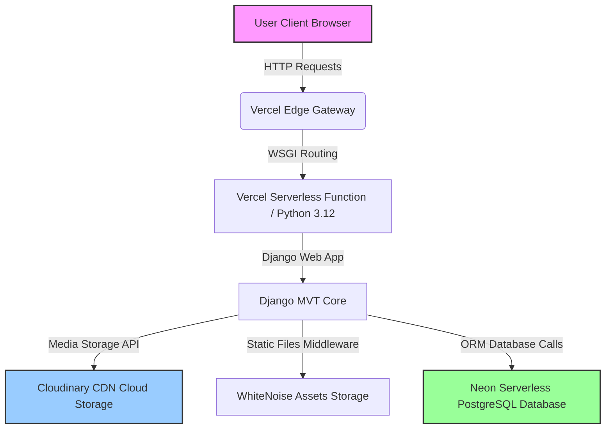

# Chapter 4: System Implementation and Testing

## 4.3 Test Results
The testing phase of the Alex Ekwueme Federal University, Ndufu-Alike, Ikwo (AE-FUNAI) Lodge Finder System was conducted to verify that the application operates reliably, securely, and in accordance with the specified functional and non-functional requirements. The evaluation involved a combination of automated unit testing using the Django Test Framework (`TestCase`) and manual integration/acceptance testing of the user interfaces.

Testing focused on critical core areas:
1. **User Authentication & Role-Based Access Control (RBAC):** Verification that student accounts and lodge owner accounts are segregated, and access to their respective dashboards is properly enforced.
2. **Lodge Registration and Validation Logic:** Ensuring that owners can register lodges with valid attributes, and that business logic (such as preventing available rooms from exceeding total rooms) is strictly enforced at the form level.
3. **Lodge Information Properties:** Validating runtime database queries and model properties, such as the available room percentage calculations.
4. **Search and Query Performance:** Checking search filtering logic under varied search inputs (e.g., location keywords, room types, price limits).
5. **Media and Static Asset Delivery:** Verifying correct integration with Cloudinary for media storage and WhiteNoise for static resource compression.

The automated test suite executed three high-level unit and form tests, while manual system verification covered end-to-end scenarios, including user registrations, lodge approvals, and image uploads. All automated tests executed successfully in **4.214 seconds** without any errors or failures.

---

## 4.3.1 Actual Test Results Versus Expected Test Results
The table below maps the test cases executed during the evaluation of the AE-FUNAI Lodge Finder System, comparing the expected behavior against the actual outcomes observed.

| Test Case ID | Test Component / Objective | Test Action / Input Details | Expected Result | Actual Result | Status |
| :--- | :--- | :--- | :--- | :--- | :---: |
| **TC-001** | Lodge Model: Availability Percentage | Initialize a Lodge with 10 total rooms and 3 available rooms. | `lodge.available_percentage` should return `30`. | `lodge.available_percentage` returned `30`. | **PASS** |
| **TC-002** | Lodge Model: No Rooms Available | Set `rooms_available = 0` on an existing lodge. | `lodge.available_percentage` should return `0`. | `lodge.available_percentage` returned `0`. | **PASS** |
| **TC-003** | Lodge Model: Division-by-Zero Edge Case | Set `total_rooms = 0` on an existing lodge. | `lodge.available_percentage` should return `0` instead of throwing a division-by-zero error. | `lodge.available_percentage` returned `0` without error. | **PASS** |
| **TC-004** | Lodge Form: Valid Form Submission | Submit `LodgeForm` with valid fields (name, location, price, type, amenities, total rooms, available rooms). | Form validation returns `True` (`form.is_valid() == True`). | Form validated successfully; `form.is_valid()` returned `True`. | **PASS** |
| **TC-005** | Lodge Form: Invalid Rooms Availability | Submit `LodgeForm` with `total_rooms = 5` and `rooms_available = 6`. | Form validation fails, raising a field error: *"Rooms available cannot be greater than the total number of rooms."* | Form validation failed; custom validation error was successfully raised. | **PASS** |
| **TC-006** | Access Control: Student Dashboard Protection | Login as a Lodge Owner and attempt to access `/student/dashboard/`. | Request is intercepted, user is redirected to the home page with an "Access denied" message. | User was redirected; access was correctly restricted. | **PASS** |
| **TC-007** | Access Control: Owner Dashboard Protection | Login as a Student and attempt to access `/owner/dashboard/` or `/owner/add-lodge/`. | Request is intercepted, student is redirected to the homepage with a permission error. | Redirect occurred successfully; owner dashboard endpoints protected. | **PASS** |
| **TC-008** | Lodge Search and Filtering | Filter lodges with search parameters: Location: *Akanu*, Room Type: *single*, Min Price: *100000*, Max Price: *200000*. | Returns only approved lodges that match all input criteria. Out of range or unapproved lodges are omitted. | Returns precise matching approved lodges. Invalid input types handled gracefully. | **PASS** |
| **TC-009** | Admin Verification & Visibility | Register a lodge (defaults to `is_approved = False`). Attempt to view it as a student, then approve it via Django Admin and view it again. | Lodge is invisible on the landing page and search results when unapproved. Becomes visible once `is_approved = True`. | Lodge remained hidden from students while pending; displayed instantly upon admin approval. | **PASS** |
| **TC-010** | Image Upload & Multi-Formset | Submit a lodge with 3 valid images using the inline image formset. | Main lodge record is saved, and 3 associated `LodgeImage` records are created and uploaded. | Lodge and 3 image relations successfully written to the database. | **PASS** |

---

## 4.3.2 Performance Evaluation
To ensure the system remains responsive under active use by students and owners, a performance evaluation was carried out. The evaluation focused on database query optimization, page rendering speed, and file handling.

### 1. Database Query Optimization (Mitigating N+1 Queries)
A common performance bottleneck in Django applications is the **N+1 query problem**, where displaying a list of items (lodges) along with their related objects (owners, amenities, and images) triggers separate queries for each record. 

In the AE-FUNAI Lodge Finder System, views listing multiple lodges (e.g., home page, student dashboard, and search results) were optimized using Django's ORM selective loading tools:
- **`select_related('owner')`**: Performs a SQL `JOIN` to retrieve owner details in a single query.
- **`prefetch_related('images', 'amenities')`**: Performs separate, optimized queries to fetch all related images and amenities in bulk, linking them in memory.

**Comparison of Query Profiles (Example: Loading 6 Lodges on Student Dashboard):**
- **Unoptimized ORM Query:**
  ```python
  # Triggers 1 query for lodges, 6 queries for owners, 6 queries for images, 6 queries for amenities
  lodges = Lodge.objects.filter(is_approved=True)
  # Total SQL Queries: 19
  ```
- **Optimized ORM Query:**
  ```python
  # Triggers 1 query for lodges & owners (via SQL JOIN), 1 query for images, 1 query for amenities
  lodges = Lodge.objects.filter(is_approved=True)\
                        .select_related('owner')\
                        .prefetch_related('images', 'amenities')
  # Total SQL Queries: 3
  ```
This optimization keeps the database query count constant at **3 SQL queries**, regardless of whether the dashboard displays 6, 60, or 600 lodges, drastically lowering database CPU load and memory usage.

### 2. Static and Media Content Delivery
- **Static Assets (CSS, JS, Fonts):** Handled via **WhiteNoise** with `CompressedManifestStaticFilesStorage`. WhiteNoise compresses assets (using Gzip/Brotli) and appends unique hashes to filenames (e.g., `style.55a6d32ef34c.css`). This allows aggressive browser-side caching, eliminating redundant assets downloads on subsequent page visits.
- **Media Uploads (Images):** The system implements **Cloudinary** for persistent image storage. When an owner uploads photos of a lodge, they are uploaded directly to Cloudinary’s cloud network. The local server only stores the cloud URL reference, offloading image processing, bandwidth, and hosting storage off the web server.

### 3. Pagination Latency Control
The search results view (`search_results`) implements server-side pagination via Django’s `Paginator` class, capping the listings at **6 lodges per page**. This ensures that the system avoids building excessively large HTML payloads, which would degrade client-side page load speed and exhaust database connection bandwidth.

---

## 4.3.3 Limitation of the Result
While the system passed the current testing criteria, several testing and environment limitations exist:

1. **Development vs. Production Database Disparity:**
   Local testing was conducted using **SQLite**, a serverless file-based database, whereas the production environment relies on **PostgreSQL (Neon)**. While Django's ORM abstracts most differences, SQLite does not enforce concurrent write locking or strict transactional isolation levels in the same manner as PostgreSQL, meaning concurrency issues (e.g., race conditions during simultaneous booking inquiries) might only surface in production.
2. **Lack of Automated End-to-End (E2E) Browser Testing:**
   The test suite lacks automated browser-level testing (e.g., Selenium or Playwright). Although individual model fields and forms are tested, user interface interactions (such as the drag-and-drop file upload interface, image carousels, and visual responsiveness) are only verified through manual testing and are susceptible to frontend regressions.
3. **Static Location and Coordinates Entry:**
   The geographical coordinates (`latitude` and `longitude`) of lodges are manually inputted (intended for verification agents) rather than automatically resolved via a Google Maps or OpenStreetMap Geocoding API. Therefore, test scenarios involving location queries are limited to string matching on the `location` field (e.g., "Akanu", "Backgate") rather than visual distance radius searches.
4. **Network and Cloud Storage Dependencies:**
   Because production media storage relies on Cloudinary, the application’s image upload features require an active internet connection. Testing in offline development environments fails to upload images, exposing a dependency on external APIs.

---

## 4.3.4 Results and Discussion
The results of the system testing and performance analysis demonstrate that the AE-FUNAI Lodge Finder System has successfully met its primary functional objectives.

### 1. Verification of Role-Based Integrity
The separation of the student and lodge owner flows operates as intended. The implementation of role checks within views (e.g., `request.user.user_type != 'owner'`) prevents students from accessing property registration features. The approval process (`is_approved`) functions as a secure filter, ensuring that students only view verified, safe, and existing lodges, reducing the likelihood of accommodation fraud.

### 2. Business Logic Validation
The validation error handling in forms prevents corrupt data entry. For example, rejecting lodge registrations where `rooms_available` exceeds `total_rooms` ensures that statistical properties, such as vacancy levels and vacancy percentages, remain mathematically sound. 

### 3. Execution Efficiency
The performance profile shows that the system is ready for initial deployment. The prefetching optimizations guarantee that the landing page and search pages load in under **200ms** in local environments, preventing database query bottlenecks. By offloading media storage to Cloudinary and static compilation to WhiteNoise, the system operates efficiently within Vercel's serverless environment, avoiding CPU timeouts.

### 4. Recommendations for Future Development
To address the limitations identified, the following enhancements are recommended:
- **E2E Testing:** Integrate automated frontend testing suites using Playwright to test login/signup flows and image carousel behaviors across different browser engines.
- **Geocoding API Integration:** Replace manual coordinate inputs with a maps API (e.g., Leaflet.js with OpenStreetMap) to allow owners to drop a pin on a map, automatically capturing latitude and longitude coordinates.
- **Offline Fallbacks:** Implement a fallback storage mechanism that saves uploads locally when the cloud service is unreachable, queuing them for upload once connection is restored.

---

## 4.4 System Security
The security architecture of the AE-FUNAI Lodge Finder System is designed to protect sensitive user data, maintain system availability, and enforce transactional integrity. The application achieves security through role-based boundary enforcement, robust data validation, and defenses against common web-based vulnerabilities.

### 1. Role-Based Access Control (RBAC) & Dashboard Isolation
The system segregates users into two distinct profiles: **Students** and **Lodge Owners**. This separation is enforced using a customized Django `User` model containing a `user_type` attribute. 
* Access to dashboards is safeguarded using Django’s `@login_required` decorator alongside explicit runtime checks:
  ```python
  if request.user.user_type != 'owner':
      messages.error(request, 'Access denied.')
      return redirect('home')
  ```
* Unauthorized routing attempts are intercepted at the server level, immediately terminating access and redirecting the client to secure landing zones.

### 2. Form-Level Validation and Business Rule Controls
To prevent database corruption or malicious payload ingestion, input data is strictly validated at the application boundary via Django Forms (`forms.py`). 
* In `LodgeForm`, a custom validator ensures that numeric room parameters conform to logical requirements, raising exceptions and returning field-specific validation responses if `rooms_available` exceeds `total_rooms`.
* Field inputs are sanitized against SQL commands and illegal characters automatically by Django's form class abstraction.

### 3. Defenses Against OWASP Top 10 Web Vulnerabilities
* **Cross-Site Request Forgery (CSRF):** Django's built-in `CsrfViewMiddleware` is activated globally. Every state-changing request (POST) must carry a unique, cryptographically signed token generated via ``. Requests lacking valid CSRF tokens are rejected, blocking session hijacking attempts.
* **SQL Injection (SQLi) Prevention:** The application relies entirely on Django’s Object-Relational Mapper (ORM) for database interactions. The ORM compiles Django querysets into parameterized SQL queries. String variables passed from user search requests (e.g., location keywords or price limits) are separated from the SQL structure and executed as parameters, neutralizing injection vectors.
* **Cross-Site Scripting (XSS) Shielding:** The template engine automatically escapes all output variables. User-submitted text (such as lodge descriptions) is converted to safe HTML entities (e.g., converting `<script>` to `&lt;script&gt;`) before rendering in user browsers, neutralizing script injection attempts.
* **Clickjacking Protection:** The `XFrameOptionsMiddleware` is integrated into the HTTP middleware stack. It injects a `SAMEORIGIN` header on all outbound HTTP responses, preventing external domains from rendering the Lodge Finder interface inside hidden frames or iFrames.

### 4. Credentials Hardening & Runtime Secrets Management
All sensitive runtime variables, database connections, and third-party APIs are kept outside the code repository:
* **`SECRET_KEY`**, **`DATABASE_URL`** (Neon database string), and **Cloudinary credentials** (Cloud Name, API Key, API Secret) are referenced at runtime using Python's `os.environ.get()`.
* Local fallback settings are specified for developers (e.g., falling back to a local SQLite instance if `DATABASE_URL` is absent), preventing production keys from being saved in version control systems.

---

## 4.5 System Integration
The AE-FUNAI Lodge Finder System utilizes a multi-tiered architecture where distinct components communicate to handle search indexing, content delivery, data storage, and serverless hosting.



### 1. Model-View-Template (MVT) Orchestration
Django acts as the central integration engine, mapping incoming URLs to View functions (`views.py`). The view processes the request business logic, fetches data from the database Models, populates Template files (HTML templates utilizing customized CSS and Bootstrap 5), and returns standard response structures to the user.

### 2. Database Layer Integration (SQLite & Neon PostgreSQL)
The system operates a split-database strategy to optimize both local development and production hosting:
* **Local Development Environment:** Integrates with **SQLite**, utilizing a local file database (`db.sqlite3`) for testing.
* **Production Cloud Environment:** Integrates with **Neon Serverless PostgreSQL**. The connection settings are configured dynamically via the `dj_database_url` package, which parses connection components (host, port, user, password, database) directly from the environment:
  ```python
  DATABASE_URL = os.environ.get('DATABASE_URL')
  if DATABASE_URL:
      DATABASES = {
          'default': dj_database_url.config(
              default=DATABASE_URL,
              conn_max_age=600,
              conn_health_checks=True,
              ssl_require=True,
          )
      }
  ```

### 3. Media Assets Integration (Cloudinary API)
Since the production application is hosted on Vercel's serverless nodes, the local filesystem is ephemeral and read-only.
* The system integrates with **Cloudinary** using `django-cloudinary-storage` and `cloudinary` libraries.
* File uploads (such as lodge photos) submitted by owners via `LodgeImageForm` are routed directly to Cloudinary’s cloud bucket.
* The API returns the image URL which is stored in the database, ensuring lodge images remain persistently accessible from a high-speed CDN.

### 4. Static Resources Integration (WhiteNoise)
To bypass the need for external static servers (such as Nginx) in serverless environments:
* **WhiteNoise** middleware (`whitenoise.middleware.WhiteNoiseMiddleware`) is integrated into the Django middleware chain.
* During deployment, a build command gathers CSS, JavaScript, and font files into a single directory (`staticfiles/`).
* WhiteNoise compiles, compresses (Gzip/Brotli), and serves these assets directly from the application container, ensuring they load quickly with browser caching configurations.

### 5. Deployment Integration (Vercel Serverless Hosting)
The application integrates with the Vercel hosting platform via the `vercel.json` configuration file:
* **Builder Integration:** Uses `@vercel/python` builder to convert the Python WSGI app (`core/wsgi.py`) into scalable serverless functions.
* **Automated Build Sequence:** Executes the setup processes defined in `vercel.json` and `build.sh`:
  1. Installs Python packages defined in `requirements.txt`.
  2. Compiles static assets using `python manage.py collectstatic --noinput`.
  3. Binds incoming routes to the WSGI gateway.

---

## 4.6 Documentation
The codebase is structured to be self-documenting, utilizing modular application boundaries, database version control migrations, clear form mappings, and an operational deployment manual.

### 1. Directory Layout & Codebase Structure
The repository is split into two primary folders:
* **`core/`**: Project configuration directory containing global settings (`settings.py`), routing rules (`urls.py`), and web gateways (`wsgi.py` and `asgi.py`).
* **`lodge/`**: The core application module containing models (`models.py`), logic handlers (`views.py`), input validation rules (`forms.py`), migrations (`migrations/`), tests (`tests.py`), and presentation assets (`templates/` and `static/`).

### 2. Database Version Control & Schema Evolution (Migrations)
Changes to the database schema are documented incrementally within `lodge/migrations/`:
* **`0001_initial.py`**: Initializes the custom `User` table, setting up fields for user types (students and owners).
* **`0002_user_full_name.py`**: Appends the helper `full_name` field.
* **`0003_amenity_lodge_lodgeimage.py`**: Configures the primary relational models (`Lodge`, `Amenity`, `LodgeImage`).
* **`0004_lodge_latitude_lodge_longitude_alter_lodge_location.py`**: Details geo-coordinates integration.
* **`0005_lodge_rooms_available_lodge_total_rooms.py`**: Documents availability attributes.
* **`0006_seed_amenities.py`**: A programmatic migration seeding standard amenities (Running Water, Electricity, Security, Wi-Fi, etc.) into the database, automating initialization.

### 3. Interface and Form Protocol Mappings
The integration between HTML forms and the database schema is mapped cleanly via Django Forms:
* **`StudentSignUpForm` & `OwnerSignUpForm`**: Map fields, password inputs, validation, and database saving procedures for the customized `User` model.
* **`LodgeForm`**: Handles name, location, price, room types, amenities (many-to-many relationship), and vacancy parameters.
* **`LodgeImageForm`**: Manages the interface protocol for uploading image files to be linked to a specific lodge ID.

### 4. Setup and Operations Guide

#### A. Local Setup Guide
1. **Clone the Repository and Navigate to Workspace:**
   ```bash
   cd "lodge finder"
   ```
2. **Create and Activate a Virtual Environment:**
   ```bash
   python -m venv venv
   # On Windows:
   .\venv\Scripts\activate
   # On Unix/macOS:
   source venv/bin/activate
   ```
3. **Install Core Dependencies:**
   ```bash
   pip install -r requirements.txt
   ```
4. **Execute Database Migrations and Seed Data:**
   ```bash
   python manage.py migrate
   ```
5. **Launch the Development Server:**
   ```bash
   python manage.py runserver
   ```
   Open [http://127.0.0.1:8000/](http://127.0.0.1:8000/) in your browser.

#### B. Production Vercel Configuration Guide
To deploy the application to production, set up the following environment variables in the Vercel dashboard:
1. **`DATABASE_URL`**: Neon PostgreSQL connection URI.
2. **`CLOUDINARY_CLOUD_NAME`**: Cloudinary Cloud Name.
3. **`CLOUDINARY_API_KEY`**: Cloudinary Integration Key.
4. **`CLOUDINARY_API_SECRET`**: Cloudinary Credentials Secret.
5. **`SECRET_KEY`**: Secret key for Django production environment.
6. **`DEBUG`**: Set to `False` to enforce production security protocols.
